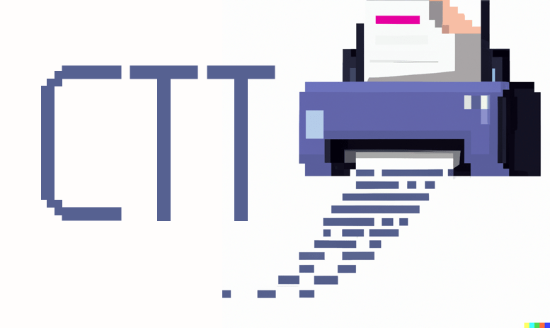

# copier-template-tester



Parametrize copier templates to test for syntax errors, check the expected output, and to check against copier versions.

Note that `ctt` only tests the `copier copy` operation and doesn't check the `update` behavior and any version-specific logic that your template may contain because of how quickly those tests become complex.

## Usage

### Configuration File

When creating a copier template repository, I recommend following the nested ["subdirectory" approach](https://copier.readthedocs.io/en/latest/configuring/#subdirectory) so that the directory looks like this:

```sh
└── template_dir
│   └── {{ _copier_conf.answers_file }}.jinja
├── README.md
├── copier.yml
└── ctt.toml
```

Create a new `ctt.toml` file in the top-level directory of your copier repository. Populate the file to look like the below example.

```toml
# Specify shared data across all 'output' destinations
# Note that the copier.yml defaults are used whenever the key is not set in this file
[defaults]
project_name = "placeholder"
copyright_year = 2022

# Parametrize each output with a relative path and optionally any values to override
[output.".ctt/defaults"]

[output.".ctt/no_all"]
package_name = "testing-no-all"
include_all = false
```

### Pre-Commit Hook

First, add this section to your `.pre-commit-config.yml` file:

```yaml
repos:
  - repo: https://github.com/KyleKing/copier-template-tester
    rev: main
    hooks:
      - id: copier-template-tester
```

Install and update to the latest revision:

```sh
pre-commit autoupdate
```

The run with `pre-commit`:

```sh
pre-commit run --all-files copier-template-tester
```

### pipx

You can also try `ctt` as a CLI tool by installing with `pipx`:

```sh
pipx install copier-template-tester

cd ~/your/copier/project
ctt
```

### More Examples

For more example code, see the [tests] directory or how this utility is used in a real project: [KyleKing/calcipy_template](https://github.com/KyleKing/calcipy_template)

## Project Status

See the `Open Issues` and/or the [CODE_TAG_SUMMARY]. For release history, see the [CHANGELOG].

## Contributing

We welcome pull requests! For your pull request to be accepted smoothly, we suggest that you first open a GitHub issue to discuss your idea. For resources on getting started with the code base, see the below documentation:

- [DEVELOPER_GUIDE]
- [STYLE_GUIDE]

## Code of Conduct

We follow the [Contributor Covenant Code of Conduct][contributor-covenant].

### Open Source Status

We try to reasonably meet most aspects of the "OpenSSF scorecard" from [Open Source Insights](https://deps.dev/pypi/copier_template_tester)

## Responsible Disclosure

If you have any security issue to report, please contact the project maintainers privately. You can reach us at [dev.act.kyle@gmail.com](mailto:dev.act.kyle@gmail.com).

## License

[LICENSE]

[changelog]: ./docs/CHANGELOG.md
[code_tag_summary]: ./docs/CODE_TAG_SUMMARY.md
[contributor-covenant]: https://www.contributor-covenant.org
[developer_guide]: ./docs/DEVELOPER_GUIDE.md
[license]: https://github.com/kyleking/copier-template-tester/LICENSE
[style_guide]: ./docs/STYLE_GUIDE.md
[tests]: https://github.com/kyleking/copier-template-tester/tests
